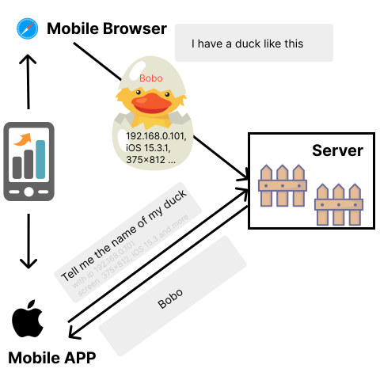

# Duck User



> If it looks like a duck and quacks like a duck, it's a duck

# Getting started

## Server

```bash
yarn add @duck-user/server
```

```typescript
import {MongoClient} from 'mongodb';
import {DuckUserServer, MongoNest} from '@duck-user/server';

// connect your mongo
let client = await MongoClient.connect('mongodb://localhost:27017');

let db = client.db('#your db name');

new DuckUserServer({
  nest: new MongoNest(db, '#your collection name'),
});
```

## Browser Client

```bash
yarn add @duck-user/web
```

```typescript
import {DuckUser} from '@duck-user/web';

const duckUser = new DuckUser({
  server: 'http://localhost:3000',
});

// In Safari
duckUser.set('foo');

// In Chrome
duckUser.get(); // ‘foo’
```

# Status

Minimum Viable Testing

# License

MIT License.
